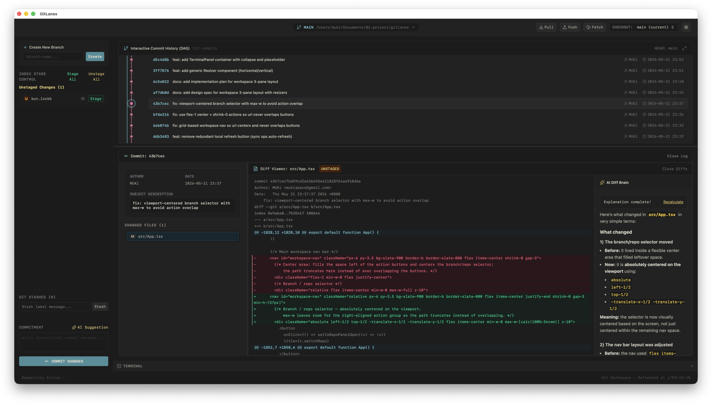

<p align="center">
  
</p>

<h1 align="center">GitLanes</h1>

<p align="center">
  <strong>A modern Git GUI for macOS — with an interactive commit graph, embedded terminal, and built-in AI assistance.</strong>
</p>

<p align="center">
  <a href="https://github.com/mukiwu/gitlanes/releases/latest"></a>
  
  
</p>

<p align="center">
  
</p>

## Download

Grab the latest signed & notarized `.dmg` from the [**Releases**](https://github.com/mukiwu/gitlanes/releases/latest) page. Once installed, GitLanes will check for updates on launch — no need to download manually next time.

> macOS 11+ on Apple Silicon. Intel Macs not supported.

---

## Features

### Interactive Commit Graph
- DAG visualization with branch lanes, tag/HEAD/remote chips
- **Right-click a commit** → Checkout / Cherry-pick / Revert / Reset `--soft|--hard` / Create Tag / Create Branch here / Copy SHA / Copy message
- **Right-click a branch chip** → Checkout / Merge into current / Rename / Copy name / Delete / Force delete
- **Right-click a tag chip** → Delete tag
- Every destructive action shows a **plain-language confirmation dialog** so you know what it'll actually do — even if you're new to git

### Sync With Remote
- One-click **Pull / Push / Fetch** in the toolbar
- Live **↑n ↓n** indicator next to the current branch
- Network operations fail fast — no hangs waiting on credential prompts
- First push on a new branch auto-sets the upstream (`-u origin`)

### Workspace
- 3-row layout — **Graph / Workspace / Terminal**, every divider is draggable
- Layout sizes persist across restarts
- **Embedded VSCode-grade interactive terminal** powered by xterm.js + portable-pty
  - Runs your `$SHELL` (zsh / bash / fish — whichever you have)
  - Full TUI support: vim, htop, `git rebase -i`, progress bars
  - Ctrl-C/D/L work, Cmd-C/V uses the system clipboard
  - Switching repos restarts the shell in the new directory

### AI Assistance
- Pick your provider: **Gemini / OpenAI / Anthropic / Ollama**
- API keys stored in the OS Keychain — never written to disk or logs
- **Explain diff** — paste a commit hash or stage some changes and let AI walk you through what changed
- **Suggest commit message** — generates a Conventional Commit based on staged diff
- Markdown rendering + follows the UI language (English / 正體中文)

### Auto-Updates
- Built-in Tauri updater checks GitHub Releases on launch
- One click to download & install the next version
- Signed with ed25519 so updates can't be tampered with in transit

### Polish
- 中英雙語介面 (English / 正體中文)
- Vitesse Dark Soft theme throughout, including the terminal
- Tuned line heights, font sizes, lane widths

---

## Known Limitations

- Apple Silicon (arm64) only — Intel Mac binaries not produced yet
- AI conversations don't have history — each prompt is independent
- Terminal is a single session — no tabs

---

## Development

### Prerequisites
- Node.js
- Rust (for Tauri)
- Git
- macOS (for now)

### Run locally
```bash
npm install
npm run dev
```
This launches the Tauri dev shell pointing at the Vite dev server.

### Build the macOS app
```bash
npm run build
```
Output: `src-tauri/target/aarch64-apple-darwin/release/bundle/`

### Release a new version
See [`docs/RELEASING.md`](docs/RELEASING.md) for the full pipeline: build → notarize → updater signing → GitHub release. TL;DR:
```bash
# bump version in 3 places, write CHANGELOG-NEXT.md, then:
./scripts/release.sh
```

### Project layout
```
src/                    # React frontend
src-tauri/src/          # Rust backend (Tauri commands, PTY, AI dispatch, keychain)
docs/superpowers/       # Design specs and implementation plans
scripts/release.sh      # One-button release pipeline
```

---

## License

MIT
